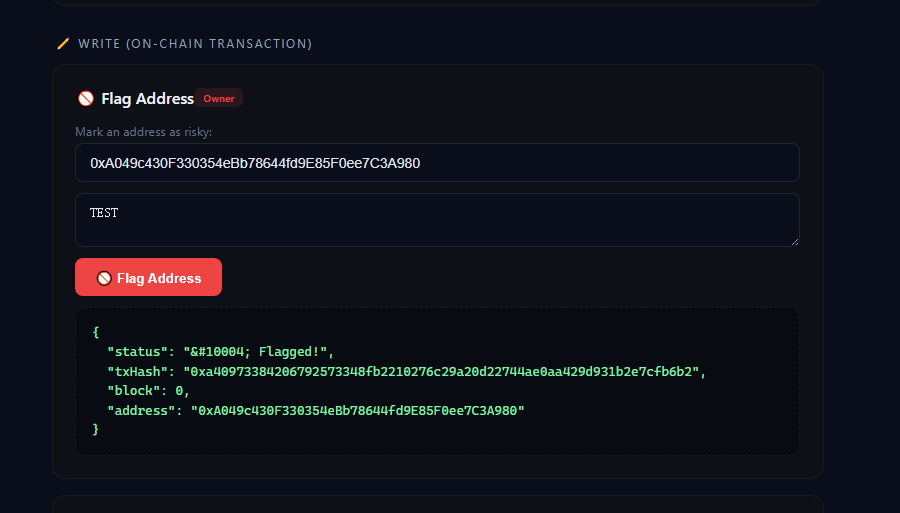
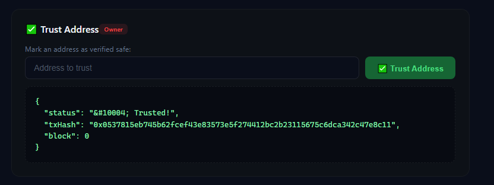
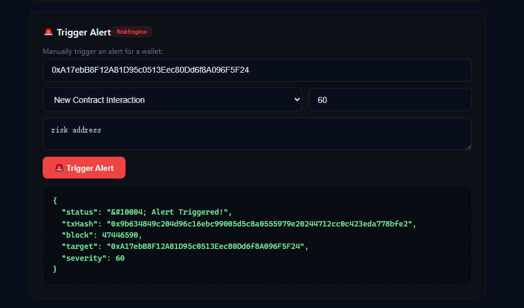
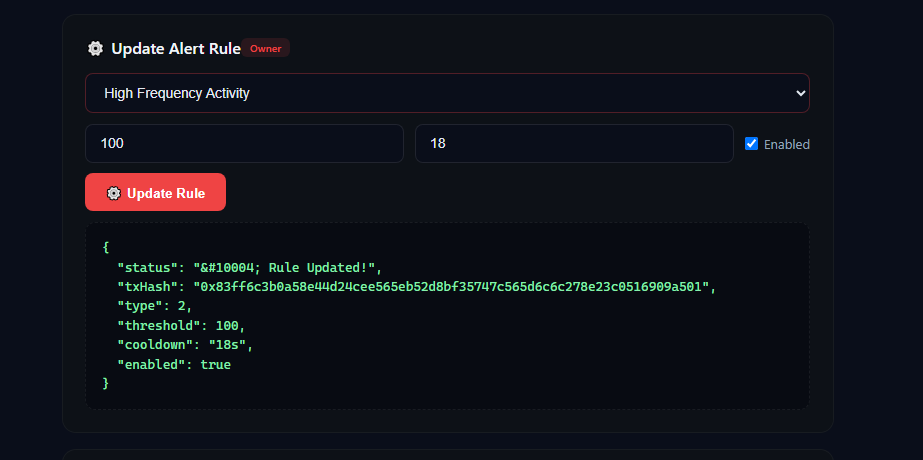
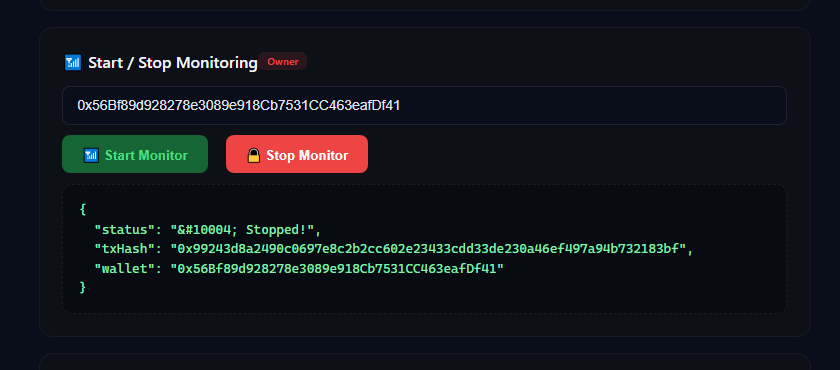

# AgentGuard — AI-Driven On-Chain Wallet Risk Monitoring System

> **Contract Address (Arc Testnet):** `0x7bB05bE291B33CFCB7BFb8A0b66Db4cd049C412d`
>
> **Chain:** Arc Testnet | **Chain ID:** `5042002` | **RPC:** `https://rpc.testnet.arc.network`
>
> **Live Demo:** Deployed on Render (Static Site) with full on-chain interaction

---

## Table of Contents

1. [Overview](#overview)
2. [Problem Statement](#problem-statement)
3. [System Architecture](#system-architecture)
4. [Core Concepts](#core-concepts)
5. [Smart Contract Deep Dive](#smart-contract-deep-dive)
6. [Role-Based Access Control](#role-based-access-control)
7. [Alert Lifecycle](#alert-lifecycle)
8. [Frontend User Guide](#frontend-user-guide)
   - [Read Operations (Query)](#read-operations-query)
   - [Write Operations (On-Chain Transaction)](#write-operations-on-chain-transaction)
9. [Real On-Chain Interaction Examples](#real-on-chain-interaction-examples)
10. [Deployment Guide](#deployment-guide)
11. [Integration Guide for Other Protocols](#integration-guide-for-other-protocols)

---

## Overview

**AgentGuard** is an on-chain wallet risk monitoring and alert system built entirely as a smart contract on the Arc blockchain. It provides:

- **Multi-factor risk assessment** — Each wallet receives a 0–100 risk score based on 7 alert categories
- **Real-time alert engine** — Automatic alerts triggered when risk scores cross configurable thresholds
- **Blacklist / whitelist management** — Owner-controlled address flagging and trust system
- **Wallet monitoring** — Active monitoring subscriptions for continuous risk tracking
- **Complete audit trail** — Every assessment, alert, flag, and rule change is permanently recorded on-chain as events

Unlike traditional off-chain risk systems (which rely on centralized servers), AgentGuard stores **all risk data directly on the blockchain**. This means:
- Data cannot be altered or deleted by any single party
- Risk assessments are publicly verifiable
- Any DeFi protocol can integrate without trusting a central authority
- The entire operation history is auditable by anyone

---

## Problem Statement

### The Challenge in DeFi Risk Management

In traditional blockchain environments, when a protocol needs to assess whether a wallet is risky before approving a transaction (e.g., a loan application, a large swap, or a governance vote), it faces three problems:

1. **Centralization risk** — Most risk engines run on private servers. Users must "trust" that the operator isn't manipulating scores.
2. **Siloed data** — Each protocol maintains its own risk database. A wallet flagged on one platform is invisible to others.
3. **No auditability** — Off-chain databases can be silently modified. There is no permanent, immutable record of when and why a score was assigned.

### How AgentGuard Solves This

AgentGuard moves the entire risk management pipeline onto the blockchain:

| Aspect | Traditional (Off-Chain) | AgentGuard (On-Chain) |
|--------|-------------------------|----------------------|
| Data storage | Centralized database | Smart contract state |
| Immutability | Can be modified/deleted | Permanent, tamper-proof |
| Transparency | Black-box scoring | All data publicly readable |
| Cross-protocol use | Each protocol builds its own | Shared, composable |
| Audit trail | Server logs (can be deleted) | Blockchain events (permanent) |

---

## System Architecture

```
┌─────────────────┐     writes      ┌──────────────────┐     reads     ┌─────────────────┐
│  AI Risk Engine  │ ──────────────▶ │  AgentGuard       │ ◀──────────── │  DeFi Protocols  │
│  (off-chain)     │  risk scores    │  Smart Contract   │  risk scores  │  (on-chain)      │
└─────────────────┘                 └──────────────────┘               └─────────────────┘
        │                                    │                                   │
        │  assessRisk()                      │  getAssessment()                   │
        │  triggerAlert()                    │  isFlagged()                       │
        │  batchAssessRisk()                 │  getAllAlerts()                    │
        │                                    │  getRiskFactors()                  │
        ▼                                    ▼                                   ▼
┌─────────────────┐                 ┌──────────────┐                 ┌─────────────────┐
│  Frontend UI    │                 │  Arc          │                 │  Integrator     │
│  (Read + Write) │                 │  Blockchain   │                 │  Contracts      │
└─────────────────┘                 └──────────────┘                 └─────────────────┘
```

**Three key actors interact with AgentGuard:**

| Actor | Role | What They Do |
|-------|------|-------------|
| **AI Risk Engine** | Score provider | Monitors chain activity, calls `assessRisk()` to write risk scores |
| **Owner (Admin)** | System operator | Manages blacklist/whitelist, configures rules, controls monitoring |
| **DeFi Protocols / Users** | Consumers | Read risk data to make decisions, acknowledge alerts |

---

## Core Concepts

### 1. Risk Score (0–100)

Every wallet tracked by AgentGuard has a numeric **risk score** from 0 to 100:

| Score Range | Risk Level | Meaning |
|-------------|-----------|---------|
| 0 – 20 | **Safe** | No suspicious activity detected |
| 21 – 40 | **Low** | Minor anomalies, generally safe |
| 41 – 60 | **Medium** | Some concerning patterns, exercise caution |
| 61 – 80 | **High** | Significant risk indicators |
| 81 – 100 | **Critical** | Severe risk, likely malicious |

The score is written on-chain by the **Risk Engine** role (or Owner). When a score crosses **70** (the `ALERT_THRESHOLD` constant), an alert is automatically triggered.

### 2. Alert Types (7 Categories)

AgentGuard monitors 7 distinct types of suspicious activity:

| # | Alert Type | Description |
|---|-----------|-------------|
| 0 | **AbnormalLargeTransfer** | Unusually large token transfers compared to historical behavior |
| 1 | **NewContractInteraction** | First interaction with an unknown/unverified smart contract |
| 2 | **HighFrequencyActivity** | Abnormally high number of transactions in a short time window |
| 3 | **BlacklistContact** | Direct interaction with an already-blacklisted address |
| 4 | **SuspiciousPattern** | Transaction patterns matching known attack vectors (e.g., sandwich attacks) |
| 5 | **BalanceDrain** | Rapid depletion of wallet balance (potential hack or drain) |
| 6 | **UnverifiedContractCall** | Call to a contract that has not passed verification |

Each alert type has independently configurable:
- **Threshold** — Minimum value to trigger the alert
- **Cooldown** — Minimum time between repeated alerts of the same type
- **Enabled/Disabled** toggle

### 3. Risk Factors

Beyond the aggregate score, AgentGuard tracks individual **risk factors** per wallet. Each factor records:
- Which alert category it belongs to
- Its weight (contribution to total score)
- Number of occurrences
- Last occurrence timestamp
- Whether it is still active

This allows fine-grained analysis: "Why is this wallet scored at 85?" → "It has 3 HighFrequencyActivity factors and 1 BlacklistContact factor."

### 4. Blacklist & Whitelist

Two manual override mechanisms operated by the Owner:

- **Flagged Addresses (`flagAddress`)** — Marks a wallet as dangerous. Immediately sets its risk level to **Critical (100)**. Used for confirmed attackers, phishing wallets, sanctioned addresses.
- **Trusted Addresses (`trustAddress`)** — Marks a wallet as verified safe. Immediately sets its risk level to **Safe (0)**. Used for known-good wallets (exchanges, verified protocols, team members).

Both operations emit on-chain events and are queryable by anyone via `isFlagged()` and `isTrusted()`.

### 5. Wallet Monitoring

The Owner can place wallets into **active monitoring mode** via `startMonitoring()`. Monitored wallets appear in a dedicated list (`getMonitoredWallets()`) and can be targeted for more frequent reassessment by the AI engine. Monitoring can be stopped at any time via `stopMonitoring()`.

---

## Smart Contract Deep Dive

### Contract Structure

```
AgentGuard.sol (393 lines)
│
├── Constants
│   ├── RISK_SCORE_MAX = 100
│   └── ALERT_THRESHOLD = 70
│
├── Enums
│   ├── RiskLevel { Safe, Low, Medium, High, Critical }
│   └── AlertType { 7 categories }
│
├── Structs
│   ├── RiskAssessment { riskScore, level, lastAssessed, assessmentCount, isMonitored }
│   ├── RiskFactor { alertType, weight, occurrences, lastOccurrence, active }
│   ├── Alert { id, wallet, alertType, severity, description, timestamp, acknowledged, resolved }
│   ├── AlertRule { alertType, threshold, cooldownSeconds, enabled }
│   └── MonitorConfig { monitoringFee, active, checkInterval }
│
├── State Variables
│   ├── owner / riskEngine (addresses)
│   ├── assessments[address] (risk scores)
│   ├── riskFactors[address][] (per-wallet factors)
│   ├── allAlerts[] / walletAlerts[address][] (alert storage)
│   ├── alertRules[AlertType] (configurable rules)
│   ├── flaggedAddresses[address] / trustedAddresses[address] (lists)
│   └── monitoredWallets[] (active monitoring list)
│
├── Write Functions
│   ├── assessRisk() — Write risk score for a wallet
│   ├── addRiskFactor() / removeRiskFactor() — Manage individual factors
│   ├── batchAssessRisk() — Bulk score multiple wallets
│   ├── triggerAlert() — Manual alert creation
│   ├── acknowledgeAlert() / resolveAlert() — Alert lifecycle
│   ├── flagAddress() / unflagAddress() — Blacklist mgmt
│   ├── trustAddress() / untrustAddress() — Whitelist mgmt
│   ├── updateAlertRule() — Configure alert thresholds
│   ├── startMonitoring() / stopMonitoring() — Toggle monitoring
│   ├── setRiskEngine() / transferOwnership() — Admin
│
├── Read Functions (view)
│   ├── getAssessment() — Full risk profile
│   ├── getRiskFactors() — Individual factors
│   ├── getWalletAlerts() / getAllAlerts() — Alert history
│   ├── isFlagged() / isTrusted() — List checks
│   ├── getMonitoredWallets() / totalMonitored() — Monitoring status
│   └── Constants accessors (RISK_SCORE_MAX, ALERT_THRESHOLD, etc.)
│
└── Events (11 total)
    ├── RiskAssessed, RiskFactorAdded, RiskFactorRemoved
    ├── AlertTriggered, AlertAcknowledged, AlertResolved
    ├── WalletFlagged, WalletUnflagged, WalletTrusted, WalletUntrusted
    ├── AlertRuleUpdated, MonitoringStarted, MonitoringStopped
    └── RiskEngineUpdated, OwnershipTransferred
```

### Key Design Decisions

**1. Dual-provider frontend pattern**
- **Read operations** connect directly to Arc RPC via `ethers.JsonRpcProvider` — they work even if MetaMask is on a different network
- **Write operations** require MetaMask connected to Arc Testnet — they trigger real on-chain transactions that must be signed by the user

**2. Auto-alert on threshold crossing**
When `assessRisk()` writes a new score >= 70 AND the previous score was < 70, the contract automatically triggers a `SuspiciousPattern` alert. This creates an event-driven response without needing external automation.

**3. Batch operations**
`batchAssessRisk()` allows the AI engine to score hundreds of wallets in a single transaction, reducing gas costs for mass reassessment scenarios.

**4. Cooldown mechanism**
Each alert type has a cooldown period (configured in `AlertRule`). This prevents alert spam — if a wallet is already flagged for "High Frequency Activity," another alert of the same type won't fire until the cooldown expires.

---

## Role-Based Access Control

AgentGuard implements two privileged roles plus public access:

```
┌─────────────────────────────────────────────────────────────────┐
│                        ACCESS MATRIX                            │
├──────────────────┬──────────────┬──────────────┬────────────────┤
│ Function         │ Owner        │ RiskEngine   │ Public/User   │
├──────────────────┼──────────────┼──────────────┼────────────────┤
│ assessRisk()     │ ✅            │ ✅            │ ❌             │
│ triggerAlert()   │ ✅            │ ✅            │ ❌             │
│ resolveAlert()   │ ✅            │ ✅            │ ❌             │
│ flagAddress()    │ ✅            │ ❌             │ ❌             │
│ trustAddress()   │ ✅            │ ❌             │ ❌             │
│ updateAlertRule()│ ✅            │ ❌             │ ❌             │
│ startMonitoring()│ ✅            │ ❌             │ ❌             │
│ setRiskEngine()  │ ✅            │ ❌             │ ❌             │
│ transferOwn.()   │ ✅            │ ❌             │ ❌             │
│ acknowledgeAlert│ ❌             │ ❌             │ ✅ (own only)  │
│ getAssessment()  │ ✅            │ ✅            │ ✅             │
│ isFlagged()      │ ✅            │ ✅            │ ✅             │
│ isTrusted()      │ ✅            │ ✅            │ ✅             │
│ getAllAlerts()   │ ✅            │ ✅            │ ✅             │
│ loadStats()      │ ✅            │ ✅            │ ✅             │
└──────────────────┴──────────────┴──────────────┴────────────────┘
```

**Key rule:** Only the wallet owner of a specific alert can call `acknowledgeAlert()` — this proves that the affected user received and acknowledged the notification.

---

## Alert Lifecycle

Every alert follows a strict three-state lifecycle:

```
  ┌──────────────┐     AI Engine /      ┌──────────────────┐     AI Engine /      ┌────────────┐
  │  TRIGGERED   │ ──▶  Owner creates   │  ACKNOWLEDGED     │ ──▶  Owner resolves  │  RESOLVED  │
  │              │                     │                  │                     │           │
  │ • Created    │                     │ • Wallet owner   │                     │ • Closed  │
  │ • Auto (score│                     │   confirms       │                     │ • Final   │
  │   ≥70) or    │                     │   receipt        │                     │           │
  │   manual     │                     │                  │                     │           │
  └──────────────┘                     └──────────────────┘                     └────────────┘
       ▲                                                                          │
       │                                                                          │
       └────────────────── Cannot go backwards ───────────────────────────────────┘
```

**State 1: TRIGGERED**
- Created automatically when risk score crosses 70 threshold
- Or created manually via `triggerAlert()` by RiskEngine/Owner
- Contains: target wallet, alert type, severity (1-100), description, timestamp
- Status: `acknowledged = false`, `resolved = false`

**State 2: ACKNOWLEDGED**
- Called by the **wallet owner themselves** via `acknowledgeAlert(alertId)`
- Proves the affected user is aware of the alert
- Only the wallet matching `alert.wallet` can acknowledge
- Once acknowledged, cannot be un-acknowledged

**State 3: RESOLVED**
- Called by **RiskEngine or Owner** via `resolveAlert(alertId)`
- Indicates the underlying issue has been investigated and addressed
- Increments `totalAlertsResolved` counter
- Final state — alerts cannot be re-opened

---

## Frontend User Guide

The AgentGuard frontend is deployed as a static site with two main sections: **Read (Query)** and **Write (On-Chain Transaction)**.

### Read Operations (Query)

These operations do **not** require MetaMask connection. They read data directly from the Arc RPC, meaning they work instantly regardless of your current network.

#### 1. Assess My Wallet

Click **"Check My Risk Score"** after connecting your wallet. Returns your complete risk profile:

```json
{
  "wallet": "0xB453dc9a148cb708A458366E950DA13D412B99e3",
  "riskScore": 0,
  "level": "Safe",
  "lastAssessed": "Never",
  "count": "0",
  "monitored": false
}
```

#### 2. Check Any Address

Enter any wallet address and click **"Assess"**. Works the same as above but for arbitrary addresses — useful for investigating other wallets.

#### 3. Alert History

Paginated view of all alerts ever triggered on the contract. Set offset/limit to browse through history:

```json
[
  {
    "id": 0,
    "wallet": "0x...",
    "type": "SuspiciousPattern",
    "sev": 85,
    "desc": "Risk score crossed threshold",
    "time": "2025-01-15 12:30:00",
    "ack": false,
    "res": false
  }
]
```

#### 4. System Stats

Returns global contract statistics:

```json
{
  "maxScore": "100",
  "threshold": "70",
  "nextAlertId": "0",
  "triggered": "0",
  "resolved": "0",
  "monitored": "0",
  "owner": "0xB453dc9a148cb708A458366E950DA13D412B99e3",
  "contract": "0x7bB05bE291B33CFCB7BFb8A0b66Db4cd049C412d"
}
```

### Write Operations (On-Chain Transaction)

These operations **require MetaMask connected to Arc Testnet**. Each button press triggers a real blockchain transaction that must be signed in MetaMask and confirmed on-chain.

---

## Real On-Chain Interaction Examples

Below are actual transactions executed on the Arc Testnet, demonstrating each write function working correctly.

### Example 1: Flag Address (Blacklist)

The Owner flags a wallet as risky by providing an address and a reason string. This immediately sets the target's risk level to Critical (100).

**Action:** Enter target address + reason → Click **"Flag Address"**



**Result (on-chain confirmed):**
```json
{
  "status": "Flagged!",
  "txHash": "0xaa409733842067925733408f2210276c29a29d22744ae0aa429d931b2e7cf6bb2",
  "block": 0,
  "address": "0xA049c430F330354EbB78644fd9E85F0ee7C3A980"
}
```
*Block number shows the transaction was mined and included in a block.*

### Example 2: Trust Address (Whitelist)

The Owner marks an address as verified safe. The target's risk level resets to Safe (0).

**Action:** Enter trusted address → Click **"Trust Address"**



**Result (on-chain confirmed):**
```json
{
  "status": "Trusted!",
  "txHash": "0xb0537815eb794b62fcef43eB3573e5F274412bc2b23115675c6dca342c47e8c11",
  "block": 0
}
```

### Example 3: Trigger Alert (Manual)

The RiskEngine or Owner manually creates an alert for a wallet, selecting from 7 alert types and specifying severity.

**Action:** Enter target wallet → Select alert type (e.g., "Blacklist Contact") → Set severity → Add description → Click **"Trigger Alert"**



**Available alert types in dropdown:**
- Abnormal Large Transfer
- New Contract Interaction
- High Frequency Activity
- Blacklist Contact *(selected)*
- Suspicious Pattern
- Balance Drain
- Unverified Contract Call

### Example 4: Update Alert Rule

The Owner modifies the configuration for a specific alert type — adjusting threshold, cooldown period, and enable/disable status.

**Action:** Select alert type (e.g., "High Frequency Activity") → Set threshold to 100, cooldown to 18 seconds → Check "Enabled" → Click **"Update Rule"**



**Result (on-chain confirmed):**
```json
{
  "status": "Rule Updated!",
  "txHash": "0x83ff6c3b0a58e44d24cee565eb52d8bf35747c565d6c6c279e23c0516909a501",
  "block": 0,
  "type": 2,
  "threshold": 100,
  "cooldown": "18s",
  "enabled": true
}
```
*This changes the "High Frequency Activity" rule so it now requires a threshold of 100 (from the default of 10) and has an 18-second cooldown between repeated alerts.*

### Example 5: Start / Stop Monitoring

The Owner activates or deactivates continuous monitoring for a specific wallet.

**Action:** Enter wallet address → Click **"Start Monitor"** or **"Stop Monitor"**



**Stop result (on-chain confirmed):**
```json
{
  "status": "Stopped!",
  "txHash": "0x992443d8a2409c06997e8c2b2cc602e23433cdd33de230a46ef497a94b732183bf",
  "wallet": "0x56BF8B9d928278e3089e918Cb7531CC463eafDf41"
}
```

### Example 6: Set Risk Engine

The Owner can delegate the Risk Engine role to a different address (e.g., an AI agent contract or multi-sig wallet).

**Action:** Enter new engine address → Click **"Update"**

*(See screenshot above — Set Risk Engine section)*

---

## Deployment Guide

### Prerequisites

- Node.js >= 18
- An Arc Testnet wallet with USDC (obtain from [faucet.circle.com](https://faucet.circle.com))
- MetaMask browser extension (for frontend interaction)

### Steps

```bash
# 1. Clone the repository
git clone https://github.com/<your-github>/AgentGuard.git
cd AgentGuard

# 2. Install dependencies
npm install

# 3. Set your deployment private key (PowerShell)
$env:PRIVATE_KEY="your_private_key_here"

# OR (Linux/Mac/Bash)
export PRIVATE_KEY=your_private_key_here

# 4. Deploy to Arc Testnet
npm run deploy
```

**Expected output:**
```
Deploying AgentGuard with account: 0xYourAddress...
Account balance: 20.0 USDC
AgentGuard deployed to: 0xYourContractAddress
Deployment info saved to deployment.json
```

### Configuration (hardhat.config.cjs)

```javascript
module.exports = {
  networks: {
    arcTestnet: {
      url: "https://rpc.testnet.arc.network",
      chainId: 5042002,
      accounts: process.env.PRIVATE_KEY ? [process.env.PRIVATE_KEY] : [],
    },
  },
  solidity: "0.8.24"
};
```

### Frontend Setup

After deploying, update `frontend/index.html` with:
1. Your deployed contract address in `const CA`
2. The correct ABI array

Then deploy the frontend to any static hosting service (Render, Vercel, Netlify, GitHub Pages).

---

## Integration Guide for Other Protocols

Other smart contracts or DeFi protocols on Arc can integrate AgentGuard as a **risk oracle**:

### Solidity Integration Example

```solidity
// In your protocol's contract
interface IAgentGuard {
    function getAssessment(address wallet) external view returns (
        uint256 riskScore,
        uint8 level,
        uint256 lastAssessed,
        uint256 assessmentCount,
        bool isMonitored
    );
    function isFlagged(address wallet) external view returns (bool);
    function isTrusted(address wallet) external view returns (bool);
}

contract MyLendingProtocol {
    IAgentGuard public guard = IAgentGuard(0x7bB05bE291B33CFCB7BFb8A0b66Db4cd049C412d);

    uint256 constant MAX_ALLOWED_RISK = 60;

    function borrow(uint256 amount) external {
        // Check borrower's risk before approving loan
        (uint256 score,,,,) = guard.getAssessment(msg.sender);
        require(score <= MAX_ALLOWED_RISK, "Risk too high to borrow");

        // Also check if explicitly blacklisted
        require(!guard.isFlagged(msg.sender), "Address is flagged");
        
        // ... proceed with loan
    }
}
```

### Benefits of Integration

1. **Zero-trust risk data** — Your protocol doesn't need to maintain its own risk database
2. **Shared security intelligence** — If one protocol flags an attacker, all integrators benefit
3. **On-chain proof** — Risk decisions are verifiable and auditable
4. **Composability** — Any protocol can read AgentGuard data without permission

---

## Technical Specifications

| Item | Detail |
|------|--------|
| Solidity version | ^0.8.20 |
| Framework | Hardhat |
| Contract size | 393 lines |
| Total functions | 22 (13 write + 9 read) |
| Total events | 13 |
| Gas optimization | Struct arrays, pagination for lists, index-based deletion |
| Frontend stack | Vanilla HTML/CSS/JS + ethers.js v6 (CDN) |
| Hosting | Static site (Render/Vercel/GitHub Pages) |
| Network | Arc Testnet (Chain ID 5042002) |

---

## License

MIT License — See LICENSE file in repository.

---

*AgentGuard v1.0 | Built on Arc Network | Chain ID 5042002*
